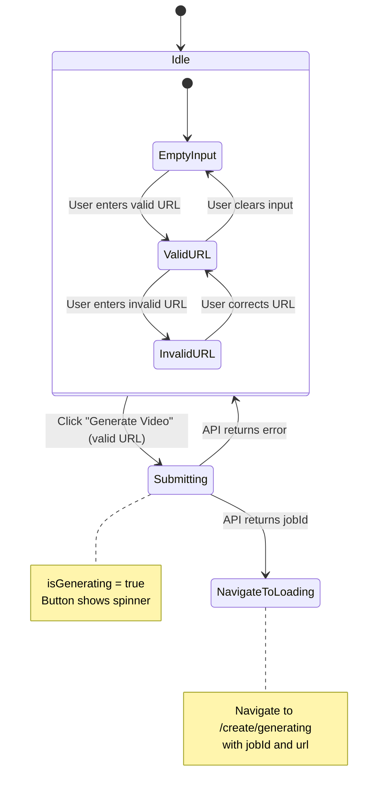
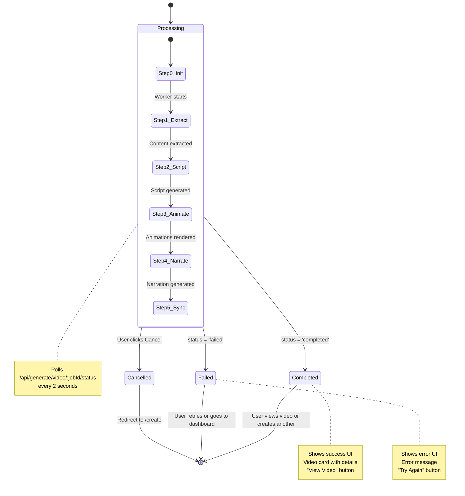
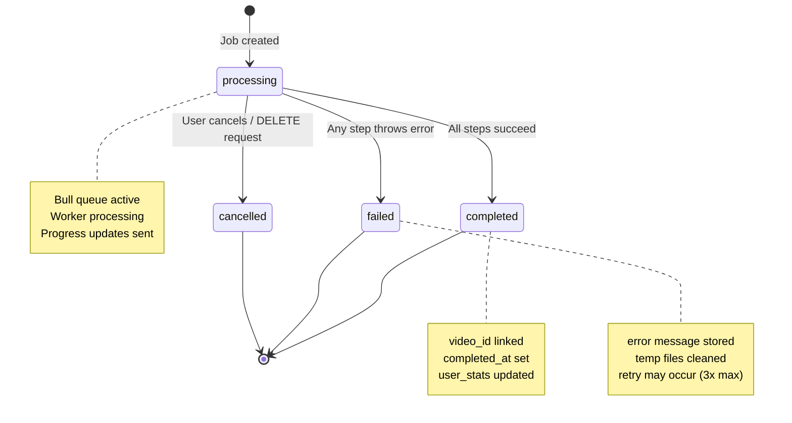
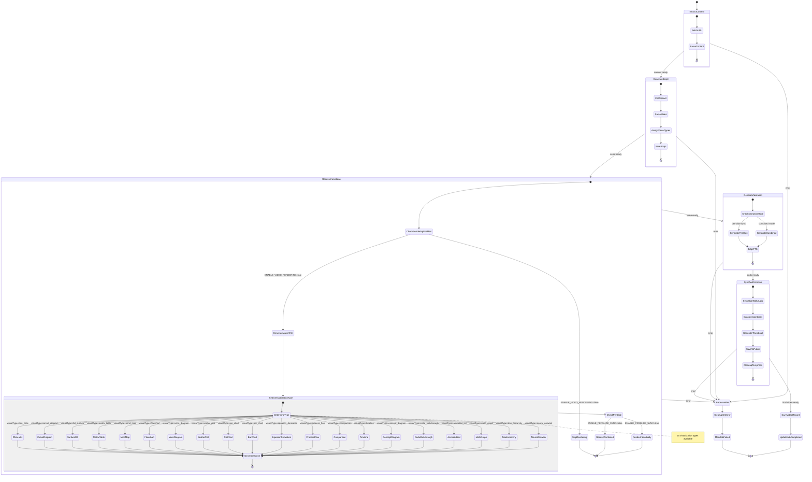
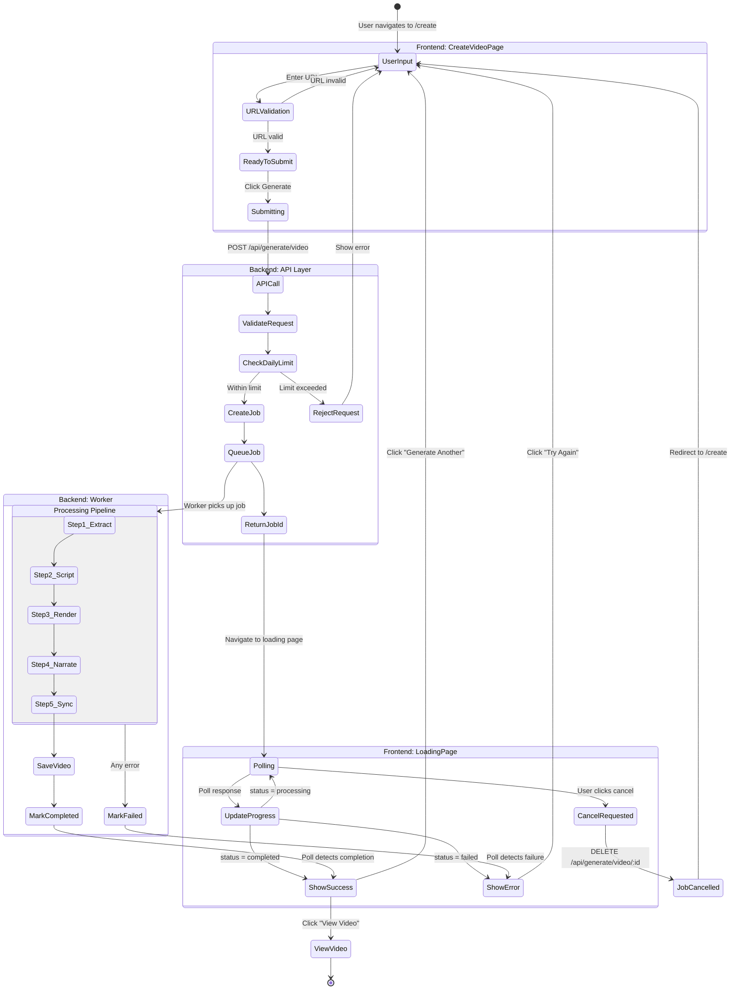
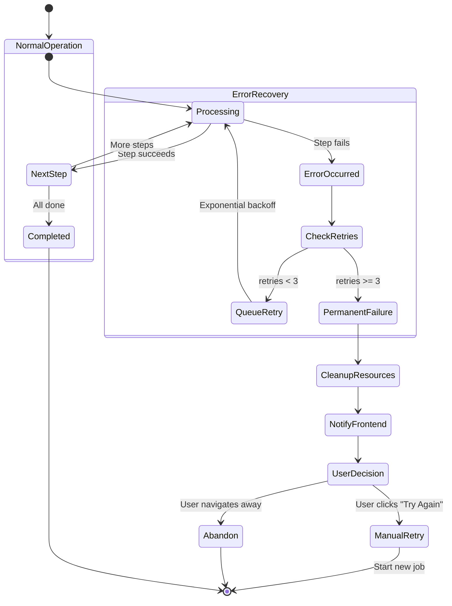
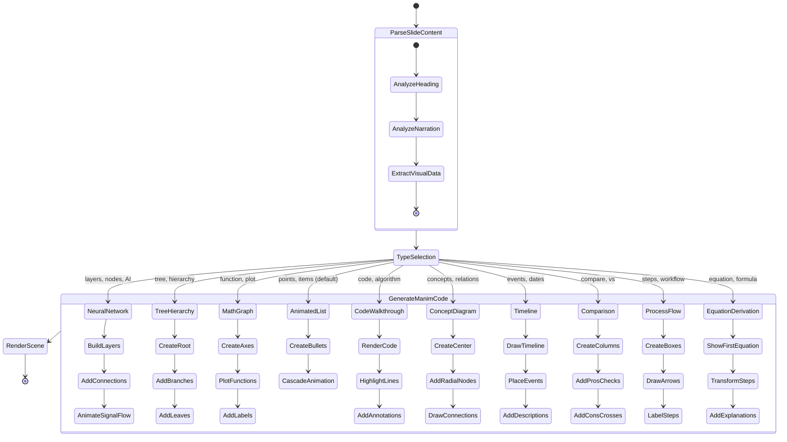

# Video Creation Feature - State Machine Diagrams

This document contains state machine diagrams for the video creation feature, covering both frontend and backend states.

---

## 1. CreateVideoPage Component States



### State Variables

| State | `url` | `isValid` | `isGenerating` | `error` |
|-------|-------|-----------|----------------|---------|
| EmptyInput | `""` | `false` | `false` | `""` |
| ValidURL | `"https://..."` | `true` | `false` | `""` |
| InvalidURL | `"invalid"` | `false` | `false` | `"Please enter a valid URL"` |
| Submitting | `"https://..."` | `true` | `true` | `""` |

---

## 2. VideoGenerationLoadingPage Component States



### Progress Steps Detail

```mermaid
stateDiagram-v2
    direction LR

    state "Step 1: Extracting" as S1 {
        note: percentage 5-15%
        note: "Extracting content from URL..."
    }

    state "Step 2: Scripting" as S2 {
        note: percentage 20-30%
        note: "Generating video script with AI..."
    }

    state "Step 3: Animating" as S3 {
        note: percentage 35-55%
        note: "Creating animated visualizations..."
    }

    state "Step 4: Narrating" as S4 {
        note: percentage 60-75%
        note: "Generating AI narration..."
    }

    state "Step 5: Syncing" as S5 {
        note: percentage 80-100%
        note: "Synchronizing video and audio..."
    }

    [*] --> S1
    S1 --> S2: Content ready
    S2 --> S3: Script ready
    S3 --> S4: Video rendered
    S4 --> S5: Audio ready
    S5 --> [*]: Final video ready
```

---

## 3. Backend Job Status States



### Database State Transitions

| Current Status | Event | New Status | Side Effects |
|----------------|-------|------------|--------------|
| `processing` | Step 5 completes | `completed` | Create video record, set `video_id`, update `user_stats` |
| `processing` | Error thrown | `failed` | Store error message, clean temp files |
| `processing` | DELETE /api/generate/video/:id | `cancelled` | Remove from Bull queue |
| `completed` | - | (terminal) | - |
| `failed` | - | (terminal) | - |
| `cancelled` | - | (terminal) | - |

---

## 4. Worker Processing Pipeline



### Visualization Type Selection

Each slide is assigned a visualization type based on content analysis:

#### Original 10 Types

| Visual Type | Trigger Keywords | Manim Elements |
|-------------|------------------|----------------|
| `neural_network` | neural, network, layers, AI, deep learning | Layered nodes, signal flow animation |
| `tree_hierarchy` | hierarchy, tree, structure, organization | Root node, branches, leaves |
| `math_graph` | graph, plot, function, equation, curve | Axes, function plots, labels |
| `animated_list` | list, points, items, steps, bullets | Bullet points, cascade animation |
| `code_walkthrough` | code, algorithm, function, syntax | Syntax highlighting, line annotations |
| `concept_diagram` | concept, related, connection, relationship | Central node, radial connections |
| `timeline` | timeline, history, events, chronological | Horizontal line, event markers |
| `comparison` | compare, versus, pros, cons, difference | Side-by-side boxes, checkmarks |
| `process_flow` | process, flow, steps, workflow, pipeline | Sequential boxes, arrows |
| `equation_derivation` | equation, formula, derivation, math | Step-by-step equation transforms |

#### New 10 Types (Added Jan 2026)

| Visual Type | Trigger Keywords | Manim Elements |
|-------------|------------------|----------------|
| `bar_chart` | bar, chart, statistics, data | Animated growing bars, axes, values |
| `pie_chart` | pie, percentage, distribution, share | Animated sectors, legend, percentages |
| `scatter_plot` | scatter, correlation, points, trend | Data points, trend line, axes |
| `venn_diagram` | venn, sets, overlap, intersection | 2-3 overlapping circles, labels |
| `flowchart` | flowchart, decision, algorithm, logic | Diamond decisions, rectangular steps |
| `mind_map` | mindmap, brainstorm, ideas, radial | Central topic, curved branches |
| `matrix_table` | table, matrix, grid, rows, columns | Animated table with headers |
| `3d_surface` | 3d, surface, terrain, mathematical | Rotating 3D surface plot |
| `circuit_diagram` | circuit, logic, gates, electronics | AND/OR/NOT gates, signal flow |
| `dna_helix` | dna, helix, biology, genetics | Animated 3D double helix |

---

## 5. End-to-End Flow State Machine



---

## 6. Error Recovery State Machine



### Retry Configuration

| Parameter | Value | Description |
|-----------|-------|-------------|
| Max Retries | 3 | Bull queue automatic retries |
| Backoff Type | Exponential | Delays: 5s, 10s, 20s |
| Timeout | 300,000ms | 5 minute job timeout |

---

## 7. ASCII State Diagram (for non-Mermaid viewers)

```
                          VIDEO CREATION STATE FLOW
================================================================================

FRONTEND (CreateVideoPage)
--------------------------
    ┌──────────────┐
    │    IDLE      │ ←───────────────────────────────┐
    │  (empty)     │                                 │
    └──────┬───────┘                                 │
           │ user enters URL                         │
           ▼                                         │
    ┌──────────────┐      invalid     ┌──────────┐  │
    │  VALIDATING  │ ──────────────→ │  ERROR   │  │
    │              │                  │          │──┘
    └──────┬───────┘ ←─────────────── └──────────┘
           │ valid                    fix URL
           ▼
    ┌──────────────┐
    │   READY      │
    │  (submit)    │
    └──────┬───────┘
           │ click Generate
           ▼
    ┌──────────────┐
    │  SUBMITTING  │ ────────→ API ERROR ──→ back to IDLE
    │  (spinner)   │
    └──────┬───────┘
           │ jobId returned
           ▼
      NAVIGATE TO
     LOADING PAGE


FRONTEND (VideoGenerationLoadingPage)
-------------------------------------

    ┌──────────────────────────────────────────────────────────┐
    │                      PROCESSING                          │
    │  ┌─────┐   ┌─────┐   ┌─────┐   ┌─────┐   ┌─────┐        │
    │  │ S1  │──→│ S2  │──→│ S3  │──→│ S4  │──→│ S5  │        │
    │  │ 15% │   │ 30% │   │ 55% │   │ 75% │   │100% │        │
    │  └─────┘   └─────┘   └─────┘   └─────┘   └─────┘        │
    │              ↑                                           │
    │              │ poll every 2s                             │
    └──────────────┼───────────────────────────────────────────┘
                   │
         ┌─────────┼─────────┬─────────────┐
         │         │         │             │
         ▼         ▼         ▼             ▼
    ┌─────────┐ ┌─────────┐ ┌───────────┐
    │COMPLETED│ │ FAILED  │ │ CANCELLED │
    │   ✓     │ │   ✗     │ │    ⊘      │
    └────┬────┘ └────┬────┘ └─────┬─────┘
         │          │             │
         ▼          ▼             ▼
    View Video   Try Again    → /create


BACKEND (Job Status)
--------------------

                    ┌─────────────┐
                    │   START     │
                    └──────┬──────┘
                           │
                           ▼
                    ┌─────────────┐
           ┌───────→│ PROCESSING  │←──────┐
           │        └──────┬──────┘       │
           │               │              │
       retry (3x)    ┌─────┴─────┬────────┴────┐
           │         │           │             │
           │         ▼           ▼             ▼
           │   ┌──────────┐ ┌──────────┐ ┌──────────┐
           └───│  ERROR   │ │COMPLETED │ │CANCELLED │
               │  (temp)  │ │  (done)  │ │  (user)  │
               └────┬─────┘ └──────────┘ └──────────┘
                    │
                    ▼ after 3 retries
               ┌──────────┐
               │  FAILED  │
               │ (final)  │
               └──────────┘
```

---

## Summary

This video creation feature uses a **three-layer state machine**:

1. **Frontend Layer**: Manages UI states (input, validation, loading, results)
2. **API Layer**: Handles request validation, job creation, status queries
3. **Worker Layer**: Processes video generation in 5 distinct steps

Key design patterns:
- **Polling**: Frontend polls backend every 2 seconds for status updates
- **Job Queue**: Bull/Redis provides async processing with automatic retries
- **Terminal States**: `completed`, `failed`, `cancelled` are final states
- **Progress Tracking**: Granular progress (0-100%) with step-level updates

---

## 8. Visualization Type State Machine



### Visualization Type Details

#### 1. Neural Network (`neural_network`)
```
Configuration:
{
  layers: [3, 5, 5, 2],
  labels: ['Input', 'Hidden', 'Output'],
  showSignalFlow: true
}

Visual Output:
  ○ ○ ○           ○ ○
   \|/  ─────────  |
  ○ ○ ○ ○ ○      ○ ○
   \|/  ─────────  |
  ○ ○ ○ ○ ○       ○
  [Input]  [Hidden]  [Output]
```

#### 2. Tree Hierarchy (`tree_hierarchy`)
```
Configuration:
{
  rootLabel: 'Machine Learning',
  children: [
    { label: 'Supervised', children: ['Classification', 'Regression'] },
    { label: 'Unsupervised', children: ['Clustering', 'Dimensionality'] }
  ]
}

Visual Output:
           [Machine Learning]
                  |
       ┌─────────┴─────────┐
  [Supervised]        [Unsupervised]
       |                    |
   ┌───┴───┐           ┌────┴────┐
[Class] [Reg]      [Cluster] [Dim]
```

#### 3. Math Graph (`math_graph`)
```
Configuration:
{
  functions: [
    { expression: 'x**2', label: 'f(x) = x²', color: 'BLUE' },
    { expression: 'np.sin(x)', label: 'g(x) = sin(x)', color: 'GREEN' }
  ],
  xRange: [-5, 5],
  yRange: [-2, 10]
}

Visual Output:
    y
    │      ╱
  10├     ╱
    │    ╱  f(x)
   5├   ╱
    │  ╱  ∿∿∿ g(x)
   0├─────────── x
    -5   0    5
```

#### 4. Animated List (`animated_list`)
```
Configuration:
{
  items: [
    { text: 'Data Collection', icon: 'arrow' },
    { text: 'Preprocessing', icon: 'arrow' },
    { text: 'Model Training', icon: 'star' }
  ],
  style: 'cascade'
}

Visual Output:
  → Data Collection
  → Preprocessing
  ★ Model Training
```

#### 5. Code Walkthrough (`code_walkthrough`)
```
Configuration:
{
  language: 'python',
  code: 'def train(model, data):\n    for epoch in range(100):\n        loss = model.forward(data)',
  highlights: [
    { lines: [2], label: 'Training loop' }
  ]
}

Visual Output:
  ┌─────────────────────────────┐
  │ 1  def train(model, data): │
  │ 2    for epoch in range(100):│ ← Training loop
  │ 3      loss = model.forward() │
  └─────────────────────────────┘
```

#### 6. Concept Diagram (`concept_diagram`)
```
Configuration:
{
  centerConcept: 'Deep Learning',
  relatedConcepts: [
    { label: 'Neural Networks', connection: 'uses' },
    { label: 'Backpropagation', connection: 'trained by' },
    { label: 'GPU Computing', connection: 'accelerated by' }
  ]
}

Visual Output:
        [Neural Networks]
               |
               | uses
               |
  [Backprop]──[Deep Learning]──[GPU]
      trained by        accelerated by
```

#### 7. Timeline (`timeline`)
```
Configuration:
{
  events: [
    { year: '1957', label: 'Perceptron', description: 'First neural network' },
    { year: '2012', label: 'AlexNet', description: 'Deep learning breakthrough' },
    { year: '2022', label: 'ChatGPT', description: 'LLM revolution' }
  ]
}

Visual Output:
  1957          2012          2022
   ●─────────────●─────────────●
   |             |             |
Perceptron   AlexNet       ChatGPT
```

#### 8. Comparison (`comparison`)
```
Configuration:
{
  items: [
    { name: 'TensorFlow', pros: ['Production-ready', 'Scalable'], cons: ['Complex API'] },
    { name: 'PyTorch', pros: ['Pythonic', 'Dynamic'], cons: ['Less deployment tools'] }
  ]
}

Visual Output:
  ┌─────────────┐   VS   ┌─────────────┐
  │ TensorFlow  │        │   PyTorch   │
  ├─────────────┤        ├─────────────┤
  │ ✓ Prod-ready│        │ ✓ Pythonic  │
  │ ✓ Scalable  │        │ ✓ Dynamic   │
  │ ✗ Complex   │        │ ✗ Deploy    │
  └─────────────┘        └─────────────┘
```

#### 9. Process Flow (`process_flow`)
```
Configuration:
{
  steps: [
    { label: 'Input', description: 'Raw data' },
    { label: 'Process', description: 'Transform' },
    { label: 'Output', description: 'Results' }
  ],
  showArrows: true
}

Visual Output:
  ┌───────┐     ┌─────────┐     ┌────────┐
  │ Input │ ──→ │ Process │ ──→ │ Output │
  │Raw data│    │Transform│     │Results │
  └───────┘     └─────────┘     └────────┘
```

#### 10. Equation Derivation (`equation_derivation`)
```
Configuration:
{
  steps: ['E = mc²', 'E = m × c × c', 'E = m × (3×10⁸)²'],
  explanations: ['Einstein formula', 'Expanded', 'With speed of light']
}

Visual Output:
     E = mc²
  (Einstein formula)
         ↓
   E = m × c × c
     (Expanded)
         ↓
  E = m × (3×10⁸)²
  (With speed of light)
```
